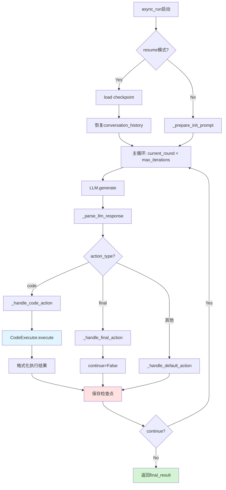
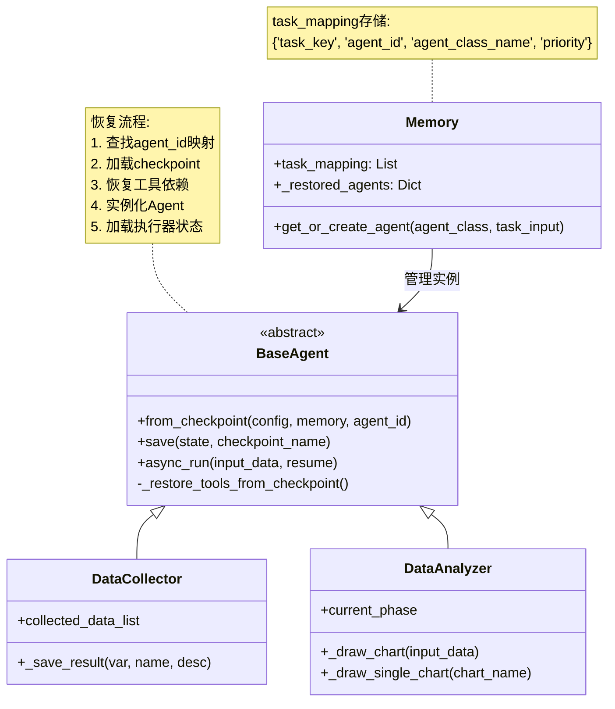

# `src/agents/` 开发者备忘录

## 1. 模块定义 (The "Why")

**一句话描述**:  
智能体系统根模块，定义BaseAgent基础框架与4类特化Agent(DataCollector/DataAnalyzer/ReportGenerator/DeepSearchAgent)，实现自治任务执行、状态持久化和Agent间协作。

**核心职责**:  
- **BaseAgent框架**: 提供对话循环、代码执行、检查点恢复、工具调用的统一基类  
- **Agent注册表**: 通过`__init_subclass__`自动注册子类到全局注册表  
- **生命周期管理**: `async_run` → `save` → `from_checkpoint` → `async_run`(恢复)  
- **多相执行**: 支持分阶段执行(phase1/2/3...)与中间检查点

---

## 2. 黑盒模型 (I/O Analysis)

| 类型 | 描述 | 关键文件/变量 |
| :--- | :--- | :--- |
| **Input (依赖)** | Config配置、Memory共享空间、Tool/Agent工具、AsyncCodeExecutor、PromptLoader、LLM客户端 | `from src.config import Config`<br>`from src.tools import Tool`<br>`from src.utils import AsyncCodeExecutor` |
| **Output (暴露)** | BaseAgent基类、4类特化Agent(DataCollector/DataAnalyzer/ReportGenerator/DeepSearchAgent)、AnalysisResult数据容器 | `__all__ = ['BaseAgent', 'DataCollector', ...]` |

---

## 3. 内部逻辑流 (The Logic)

### 文件拓扑

| 文件/目录 | 职责 |
| :--- | :--- |
| **`base_agent.py`** | BaseAgent基类实现：对话循环、状态管理、工具调用、检查点恢复(649行) |
| **`data_collector/`** | 数据采集Agent，调用financial/macro/web工具采集数据(162行) |
| **`data_analyzer/`** | 数据分析Agent，代码驱动分析+VLM图表优化(611行，分4个Phase) |
| **`report_generator/`** | 报告生成Agent，大纲→章节→后处理的多阶段报告撰写 |
| **`search_agent/`** | 深度搜索Agent，多跳网络搜索+页面抓取 |

### BaseAgent核心流程



### Agent恢复机制



---

## 4. 避坑指南 (Attention)

### 硬编码参数

| 位置 | 硬编码值 | 说明 | 修改建议 |
| :--- | :--- | :--- | :--- |
| **base_agent.py Line 37** | `"deepseek-chat"` | 默认LLM模型名 | 应从Config默认值读取 |
| **base_agent.py Line 100** | `checkpoint_name='latest.pkl'` | 默认检查点名 | 可扩展为多版本管理 |
| **base_agent.py Line 464** | `max_iterations=10` | 最大对话轮数 | 不同Agent应有不同上限 |
| **data_analyzer.py Line 28** | `use_vlm_name="qwen/..."`硬编码 | VLM模型名 | 应从.env配置 |
| **data_analyzer.py Line 97-106** | `custom_palette`配色方案 | 中国风硬编码 | 可配置化 |
| **data_analyzer.py Line 271** | `Semaphore(1)` | 图表生成串行化 | **性能瓶颈**，需要隔离环境才能并发 |

### 复杂条件判断

#### ⚠️ 工具恢复递归 (base_agent.py Line 227-301)

**多层嵌套**:
```python
async def _restore_tools_from_checkpoint(...):
    for dep in tool_dependencies:
        if dep['type'] == 'agent':
            # 递归恢复依赖Agent
            dep_agent = await cls.from_checkpoint(...)  # 🔥 递归调用
            if dep_agent:
                restored_tools.append(dep_agent)
        elif dep['type'] == 'tool':
            tool_instance = get_tool_by_name(...)
```

**避坑要点**:  
- **循环依赖检测缺失**: 如果Agent A依赖B，B依赖A，会无限递归  
- `restored_agents`字典用于去重，但仅在单次恢复有效  
- **修改建议**: 增加依赖深度限制或依赖图拓扑排序

#### ⚠️ DataAnalyzer多阶段控制 (data_analyzer.py Line 474-564)

**复杂状态机**:
```python
if self.current_phase == 'phase1':
    # 数据分析对话
    run_result = await super().async_run(...)
    self.current_phase = 'phase2'
elif self.current_phase == 'phase2':
    # 解析报告
    report_title, content = _parse_generated_report(...)
    self.current_phase = 'phase3'
elif self.current_phase == 'phase3' and enable_chart:
    # 绘制图表
    await _draw_chart(...)
    self.current_phase = 'phase4'
```

**避坑要点**:  
- **状态污染**: `current_phase`存储在checkpoint中，resume时可能与预期不一致  
- **phase跳过逻辑**: 如果`enable_chart=False`，需要跳过phase3但代码逻辑复杂  
- **修改建议**: 使用状态机模式类(如Python `enum.Enum`)明确状态转换规则

#### ⚠️ 图表VLM优化循环 (data_analyzer.py Line 332-406)

**三层循环嵌套**:
```python
for iteration in range(max_iterations):  # VLM优化轮数
    for _ in range(3):  # 代码生成重试
        llm_response = await self.llm.generate(...)
        code_result = await self.code_executor.execute(...)
        if not code_result['error']:
            break  # 成功则跳出
    # VLM评估
    critic_response = await self.vlm.generate(...)
    if 'finish' in critic_response.lower():
        break
```

**避坑要点**:  
- 最坏情况: `max_iterations=3 * 3 = 9`次LLM调用  
- **VLM停止条件**依赖字符串匹配`'finish'`，不够鲁棒  
- **修改建议**: 增加Token消耗统计，设置总开销上限

### 检查点陷阱

#### ⚠️ 双重检查点系统 (data_analyzer.py)

```python
# latest.pkl: 主检查点
await self.save(state={...}, checkpoint_name='latest.pkl')
# charts.pkl: 图表专用检查点
await self.save(state={'charts_state': {...}}, checkpoint_name='charts.pkl')
```

**问题**:  
- 两个检查点不同步可能导致状态不一致  
- 如果仅恢复`latest.pkl`会丢失图表进度  
- **修改建议**: 合并为单一检查点，或增加版本号机制

#### ⚠️ Agent ID不变性假设 (base_agent.py Line 45-48)

```python
if agent_id is None:
    self.id = f'agent_{self.AGENT_NAME}_{uuid.uuid4().hex[:8]}'
else:
    self.id = agent_id  # 🔥 恢复时保持不变
```

**避坑要点**:  
- 如果同一任务多次运行会生成不同`agent_id`  
- Memory的`task_mapping`依赖`agent_id`查找，ID变化会导致恢复失败  
- **修改建议**: 使用确定性ID(如`hash(task_key)`)

### 性能注意

| 操作 | 时间开销 | 优化建议 |
| :--- | :--- | :--- |
| `from_checkpoint` | O(n*m) (n个工具, m个递归) | 缓存恢复结果，避免重复加载 |
| DataAnalyzer图表生成 | O(k*p) (k个图表, p个优化轮) | 串行化导致总时间长，需要环境隔离才能并发 |
| `save`检查点 | O(s) (state大小) | Dill序列化大对象慢，考虑增量保存 |

### 调试技巧

```python
# 查看已注册Agent
from src.agents.base_agent import _AGENT_REGISTRY
print("已注册Agent:", list(_AGENT_REGISTRY.keys()))

# 测试Agent恢复
from src.agents import DataCollector
from src.config import Config
from src.memory import Memory

config = Config(config_file_path='my_config.yaml')
memory = Memory(config=config)
agent = await BaseAgent.from_checkpoint(
    config=config,
    memory=memory,
    agent_id='agent_data_collector_abc123',
    checkpoint_name='latest.pkl'
)

# 检查检查点内容
import dill
with open('.cache/latest.pkl', 'rb') as f:
    state = dill.load(f)
print(state.keys())  # 查看保存了哪些字段

# 调试Phase状态
analyzer = DataAnalyzer(...)
print(f"Current phase: {analyzer.current_phase}")
await analyzer.save(state={'current_phase': 'phase2'})
```

### 常见错误

#### 1. Agent恢复失败

**症状**: `from_checkpoint`返回None  
**原因**:  
- checkpoint文件不存在  
- `agent_name`不在`_AGENT_REGISTRY`中  
- 依赖Agent恢复失败(递归)  

**排查**:
```python
# 检查checkpoint路径
import os
cache_dir = os.path.join(config.working_dir, 'agent_working', agent_id, '.cache')
print(os.listdir(cache_dir))
```

#### 2. conversation_history过长

**症状**: LLM调用报`Error code: 400`上下文超限  
**原因**: 对话轮数过多,未清理历史  
**解决**: 在`async_run`中定期截断conversation_history

#### 3. 图表文件未生成

**症状**: `_draw_single_chart`返回`(None, None)`  
**原因**: LLM生成的代码未调用`plt.savefig()`或路径错误  
**解决**: 检查`action_content`中的savefig路径是否包含`session_output_dir`
