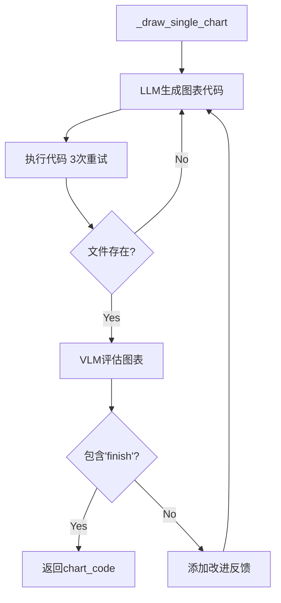

# `src/agents/data_analyzer/` 开发者备忘录

## 1. 模块定义
**一句话**: 代码驱动的数据分析智能体，生成分析报告并通过VLM迭代优化图表质量(CAVM架构核心)。

**核心职责**: 分析任务 → 执行Python代码分析 → 生成Markdown报告 → VLM优化图表 → 输出AnalysisResult

## 2. I/O分析

| 类型 | 描述 | 关键依赖 |
| :--- | :--- | :--- |
| **Input** | `{task, analysis_task}`, Memory中的collect_data_list, use_vlm_name | `self.memory.get_collect_data()` |
| **Output** | AnalysisResult(title, content, chart_name_mapping), 图片保存到`images/` | `self.memory.add_data(AnalysisResult(...))` |

## 3. 内部逻辑

**文件**: `data_analyzer.py` (611行)

**4阶段执行**:
```
Phase 1: 数据分析对话 (BaseAgent.async_run)
Phase 2: 解析报告(_parse_generated_report)
Phase 3: 图表绘制(_draw_chart)
  └─ 并发控制: Semaphore(1)
  └─ VLM优化循环: max_iterations=3
Phase 4: 保存AnalysisResult到Memory
```

**VLM优化单图流程**:


## 4. 避坑指南

| 陷阱 | 位置 | 说明 | 建议 |
| :--- | :--- | :--- | :--- |
| **串行图表生成** | Line 271 | `Semaphore(1)`导致性能瓶颈 | 需要隔离Code Executor才能并发 |
| **Phase状态不一致** | Line 488-564 | current_phase可能因checkpoint不同步导致跳步 | 使用状态机模式验证转换 |
| **VLM停止条件脆弱** | Line 394 | `if 'finish' in critic_response.lower()`依赖字符串 | 改为结构化JSON响应 |
| **双重检查点** | charts.pkl + latest.pkl | 可能不同步导致状态丢失 | 合并或增加版本校验 |
| **图表文件名提取正则** | Line 445 | `r"[\"']([^\"']+\.png)[\"']"`可能匹配错误 | 要求LLM输出特定格式 |
| **自定义配色硬编码** | Line 97-106 | 中国风配色写死 | 从Config读取或支持主题 |
