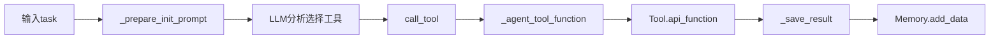

# `src/agents/data_collector/` 开发者备忘录

## 1. 模块定义
**一句话**: 数据采集智能体，通过LLM自主选择和调用financial/macro/industry/web工具收集结构化数据。

**核心职责**: 接收采集任务 → 分析所需数据源 → 调用API工具 → 结果保存到Memory.data

## 2. I/O分析

| 类型 | 描述 | 关键依赖 |
| :--- | :--- | :--- |
| **Input** | `{task: 采集任务描述}`, Tools(DeepSearchAgent + financial/macro/industry工具) | `from src.tools import get_tool_categories` |
| **Output** | `collected_data_list: List[ToolResult]`, 保存到Memory.data | `self.memory.add_data(ToolResult(...))` |

## 3. 内部逻辑

**文件**: `data_collector.py` (162行)

**关键流程**:
```
1. _set_default_tools(): 注册除web外的所有工具类
2. _prepare_init_prompt(): 构造Prompt(含API文档 + 研究目标)
3. async_run() → BaseAgent对话循环
4. LLM生成<execute>代码调用call_tool()
5. _save_result()将结果包装为ToolResult
6. 保存到Memory.data + collected_data_list
```

**Mermaid流程**:


## 4. 避坑指南

| 陷阱 | 位置 | 说明 | 建议 |
| :--- | :--- | :--- | :--- |
| **默认工具硬编码** | Line 48-53 | `if tool_type == 'web': continue`跳过web工具 | 应允许配置化控制 |
| **重复数据保存** | Line 70-81 | 同样对象既add到Memory又append到collected_data_list | 考虑统一为Memory |
| **无并发限制** | async_run | 多个DataCollector并发可能触发API限流 | 增加Semaphore控制 |
| **target_language映射** | Line 94-98 | 硬编码zh/en映射 | 扩展时需添加其他语言 |
