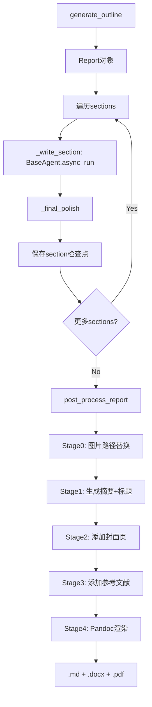

# `src/agents/report_generator/` 开发者备忘录

## 1. 模块定义
**一句话**: 报告生成Agent，执行大纲→章节→后处理的三阶段流程，输出Word/PDF专业报告。

**核心职责**: 大纲生成 → 逐节撰写(引用数据/图表) → 后处理(摘要/封面/参考文献/渲染)

## 2. I/O分析

| 类型 | 描述 | 关键依赖 |
| :--- | :--- | :--- |
| **Input** | `{task}`, Memory中的collect_data + analysis_result, outline_template.md | `self.memory.get_collect_data()` |
| **Output** | Report对象(Markdown), .docx/.pdf文件, 保存到working_dir | `report.render_to_docx()` |

## 3. 内部逻辑

**文件**: `report_generator.py` (944行)

**三阶段流程**:
```
Phase 0: 大纲生成 (generate_outline)
  └─ Agent对话生成Markdown大纲 → Report对象

Phase 1: 章节撰写 (_write_sections)
  └─ 逐Section调用BaseAgent.async_run
  └─ _final_polish: LLM润色章节
  └─ 检查点: section_{idx}.pkl

Phase 2: 后处理 (post_process_report)
  └─ Stage 0: _replace_image_path (语义搜索匹配图片)
  └─ Stage 1: _add_abstract + title
  └─ Stage 2: _add_cover_page (财报表格+K线图)
  └─ Stage 3: _add_reference (引用匹配+编号)
  └─ Stage 4: Pandoc渲染docx → docx2pdf
  └─ 检查点: report_latest.pkl
```

**Mermaid流程**:


## 4. 避坑指南

| 陷阱 | 位置 | 说明 | 建议 |
| :--- | :--- | :--- | :--- |
| **Image匹配递归索引重建** | Line 332-333 | 每匹配一张图就重建IndexBuilder | **性能灾难**，应预先构建完整索引 |
| **Pandoc依赖** | Line 632-648 | 硬依赖系统Pandoc命令 | 提前检测Pandoc是否安装 |
| **中文列名硬编码** | Line 431-434 | `'日期'`, `'收盘'`等中文列名 | 改为双语兼容映射 |
| **Post-stage顺序依赖** | Line 561-660 | Post_stage必须按顺序0→1→2→3→4 | 跳过阶段会导致状态错乱 |
| **docx2pdf兼容性** | Line 652 | Windows依赖MS Word COM | Linux/Mac环境会失败 |
| **Citation正则** | Line 490 | `[Source: xxx]`或`[source: xxx]`依赖字符串 | 要求LLM严格按格式输出 |
| **PDF转换异常吞没** | Line 653 | 仅log error不终止 | 应明确告知用户PDF生成失败 |
