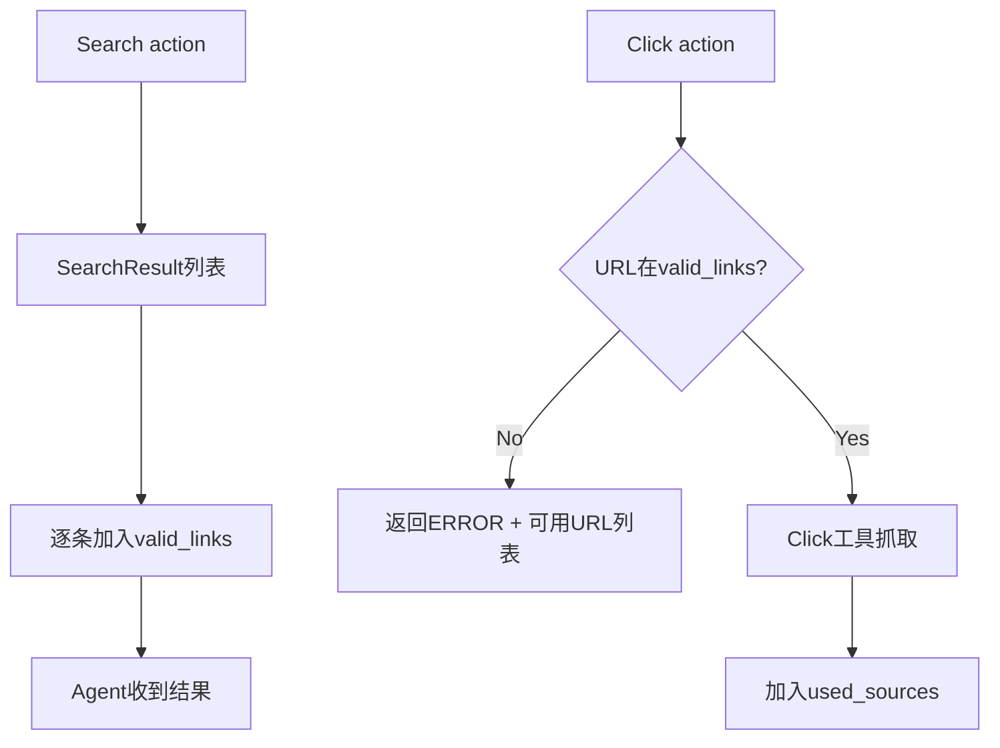

# `src/agents/search_agent/` 开发者备忘录

## 1. 模块定义
**一句话**: 深度网络搜索Agent，执行多跳搜索+网页抓取，带URL白名单验证机制。

**核心职责**: 接收query → 调用搜索引擎 → 点击URL抓取内容 → 生成带引用的搜索报告(DeepSearchResult)

## 2. I/O分析

| 类型 | 描述 | 关键依赖 |
| :--- | :--- | :--- |
| **Input** | `{task, query}`, Search/Click工具(SerperSearch/BingSearch/Click) | `self.tools = [SerperSearch(), Click()]` |
| **Output** | DeepSearchResult(query, summary, sources), 保存到Memory.data| `self.memory.add_data(agent_result)` |

## 3. 内部逻辑

**文件**: `search_agent.py` (334行)

**关键流程**:
```
1. _handle_search_action(): 
   - 调用搜索引擎API → SearchResult列表
   - 更新valid_links白名单
   - 保存到Memory.data

2. _handle_click_action():
   - URL白名单验证 (Line 165)
   - 调用Click工具抓取网页内容
   - 更新used_sources记录
   - 保存ClickResult到Memory

3. _build_available_sources_list():
   - 最后一轮提供所有可用sources列表
   - 区分used_sources(已浏览)和valid_links(仅搜索)
```

**URL白名单机制**:


## 4. 避坑指南

| 陷阱 | 位置 | 说明 | 建议 |
| :--- | :--- | :--- | :--- |
| **URL白名单验证** | Line 165 | 仅允许点击搜索结果中的URL | **防止LLM幻觉**产生无效URL |
| **max_iterations=30** | Line 294 | 搜索Agent默认30轮 | 比其他Agent高3倍，注意成本 |
| **最后一轮提醒** | Line 149, 229 | 强制在最后一轮提供sources列表 | 确保LLM引用有效sources |
| **link2name映射** | Line 112, 201 | 用于Click结果的Title回填 | 如果Search未保存title会丢失 |
| **enable_code=False** | Line 23 | DeepSearchAgent不使用CodeExecutor | 简化逻辑，仅工具调用 |
