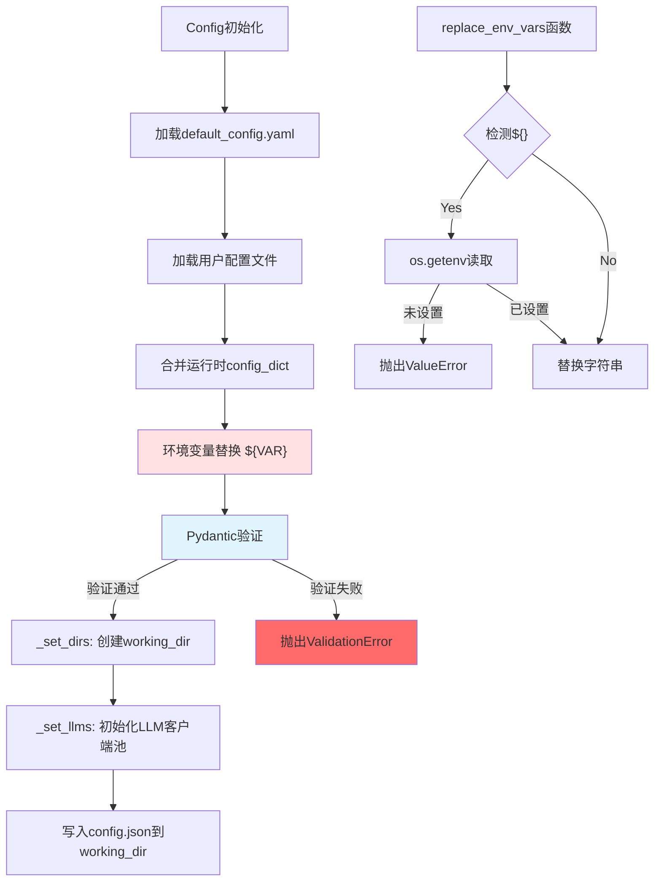
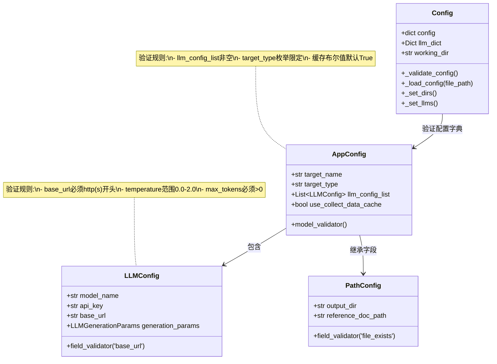

# `src/config/` 开发者备忘录

## 1. 模块定义 (The "Why")

**一句话描述**:  
基于Pydantic的配置管理层，负责加载、验证、合并多源配置(YAML/JSON/字典/环境变量)并初始化LLM客户端。

**核心职责**:  
- **多源配置合并**: `default_config.yaml` → 用户配置文件 → 运行时字典(按优先级覆盖)  
- **环境变量替换**: 支持`${VAR_NAME}`占位符，从`.env`文件读取敏感信息  
- **类型安全验证**: 通过Pydantic模型自动校验配置项的类型和取值范围  
- **LLM客户端池**: 初始化多个LLM实例到`llm_dict`，供全局使用

---

## 2. 黑盒模型 (I/O Analysis)

| 类型 | 描述 | 关键文件/变量 |
| :--- | :--- | :--- |
| **Input (依赖)** | YAML配置文件(`my_config.yaml`)、默认配置(`default_config.yaml`)、环境变量(`.env`)、Pydantic模型(`models.py`)、AsyncLLM类(`utils/llm.py`) | `from src.utils import AsyncLLM`<br>`from .models import AppConfig` |
| **Output (暴露)** | Config类实例，包含验证后的配置字典(`config`)、工作目录(`working_dir`)、LLM客户端池(`llm_dict`) | `class Config`<br>`self.config: dict`<br>`self.llm_dict: Dict[str, AsyncLLM]` |

---

## 3. 内部逻辑流 (The Logic)

### 文件拓扑

| 文件 | 职责 |
| :--- | :--- |
| `config.py` | Config类主体，负责加载、验证、初始化逻辑(153行) |
| `models.py` | Pydantic数据模型，定义AppConfig/LLMConfig/PathConfig等Schema(129行) |
| `default_config.yaml` | 默认配置模板，提供必选参数的兜底值 |
| `__init__.py` | 模块导出接口 |

### 逻辑可视化



### Pydantic验证流程



---

## 4. 避坑指南 (Attention)

### 硬编码参数

| 位置 | 硬编码值 | 说明 | 修改建议 |
| :--- | :--- | :--- | :--- |
| **Line 21** | `"default_config.yaml"` | 默认配置文件名 | 可通过环境变量覆盖路径 |
| **Line 127** | `target[:50]` | 目标名称最大长度 | 避免路径过长，但应配置化 |
| **Line 133** | `'config.json'` | 配置备份文件名 | 可改为时间戳命名支持多版本 |
| **Line 88** | `r'\$\{([^}]+)\}'` | 环境变量正则模式 | **勿修改**，标准占位符格式 |

### 复杂条件判断

#### ⚠️ 环境变量替换递归 (Line 79-99)

**复杂度**: 需递归处理嵌套的dict/list结构

```python
def replace_env_vars(obj):
    if isinstance(obj, dict):
        return {key: replace_env_vars(value) ...}  # 递归字典
    elif isinstance(obj, list):
        return [replace_env_vars(item) ...]         # 递归列表
    elif isinstance(obj, str):
        # 正则匹配 ${VAR_NAME}
```

**避坑要点**:  
- 如果环境变量未设置，会直接`raise ValueError`(Line 94)  
- **循环引用检测缺失**: `llm1: ${llm2}`, `llm2: ${llm1}`会导致无限递归  
- **修改建议**: 增加递归深度限制或环境变量依赖拓扑排序

#### ⚠️ 配置优先级覆盖 (Line 22-31)

**合并顺序**:
```python
1. self.config = _load_config('default_config.yaml')
2. self.config.update(file_config)              # 用户配置
3. self.config.update(config_dict)              # 运行时参数(最高优先级)
```

**避坑要点**:  
- `update()`是浅拷贝，嵌套字典不会深度合并  
- 例如: `llm_config_list`会整体覆盖，而非逐项合并  
- **修改建议**: 实现深度合并函数(如`deep_merge`)

#### ⚠️ Pydantic验证时机 (Line 48-58)

**验证流程**:
```python
validated_config = AppConfig(**self.config)       # 验证
self.config = validated_config.model_dump()       # 转回字典
```

**避坑要点**:  
- Pydantic 2.x使用`model_dump()`(旧版是`dict()`)  
- `extra="allow"`会保留未定义字段，可能隐藏配置错误  
- **修改建议**: 生产环境改为`extra="forbid"`严格模式

### 文件路径验证

#### ⚠️ 路径存在性检查 (models.py Line 59-64)

```python
@field_validator('reference_doc_path', 'outline_template_path')
def validate_file_exists(cls, v: Optional[str]) -> Optional[str]:
    if v is not None and not os.path.exists(v):
        raise ValueError(f'文件不存在: {v}')
```

**避坑要点**:  
- **相对路径陷阱**: `os.path.exists()`基于当前工作目录(CWD)  
- 如果从不同目录运行`python run_report.py`，相对路径可能失效  
- **修改建议**: 验证前转换为绝对路径(`os.path.abspath()`)

### LLM客户端初始化

#### ⚠️ llm_dict覆盖问题 (Line 137-149)

```python
for llm_config in llm_config_list:
    model_name = llm_config['model_name']
    llm_dict[model_name] = AsyncLLM(...)  # 相同model_name会覆盖
```

**避坑要点**:  
- 如果配置了多个相同`model_name`的LLM，只保留最后一个  
- **修改建议**: 改为`{model_name}#{index}`作为key，或报错提示重复

### 性能注意

| 操作 | 时间开销 | 优化建议 |
| :--- | :--- | :--- |
| YAML解析 | 中等(50-100ms) | 缓存解析结果，避免重复读取 |
| Pydantic验证 | 中等(10-50ms) | 仅在配置修改时验证 |
| working_dir初始化 | 低(磁盘I/O) | 可异步创建目录 |
| config.json写入 | 低(1-5ms) | 可配置为可选操作 |

### 调试技巧

```python
# 调试环境变量替换
import os
os.environ['DEBUG_CONFIG'] = '1'

# 打印最终配置
config = Config(config_file_path='my_config.yaml')
print(json.dumps(config.config, indent=2, ensure_ascii=False))

# 检查Pydantic验证错误详情
try:
    AppConfig(**config_dict)
except ValidationError as e:
    print(e.json())  # JSON格式的详细错误信息
```
