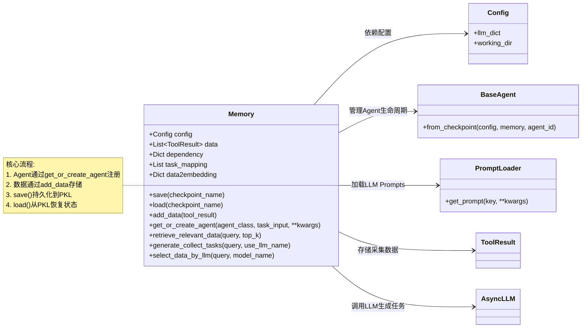
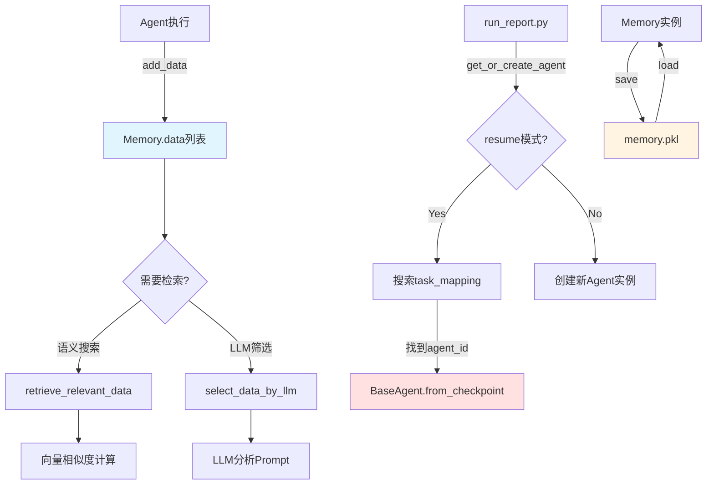

# `src/memory/` 开发者备忘录

## 1. 模块定义 (The "Why")

**一句话描述**:  
智能体间的共享数据交换中心与状态持久化层，负责管理所有Agent的数据共享、任务编排和检查点恢复。

**核心职责**:  
- **数据中转站**: 采集数据(`ToolResult`)、分析结果(`AnalysisResult`)的统一存储与检索  
- **任务编排**: 管理Agent实例的创建、恢复、优先级调度  
- **断点续传**: 持久化Memory状态(`.pkl`)，支持任意阶段恢复  
- **智能检索**: 基于Embedding的语义搜索、LLM驱动的数据筛选

---

## 2. 黑盒模型 (I/O Analysis)

| 类型 | 描述 | 关键文件/变量 |
| :--- | :--- | :--- |
| **Input (依赖)** | Config对象(配置管理)、BaseAgent类(智能体基类)、Tools结果(`ToolResult`)、搜索结果(`DeepSearchResult`)、LLM模型(`llm.py`)、Prompt加载器(`prompt_loader.py`) | `from src.config import Config`<br>`from src.agents.base_agent import BaseAgent`<br>`from src.tools import ToolResult`<br>`from src.utils import get_logger` |
| **Output (暴露)** | Memory类实例，提供数据存储(`add_data`)、Agent管理(`get_or_create_agent`)、语义检索(`retrieve_relevant_data`)、状态持久化(`save/load`)等API | `__all__ = ["Memory"]` |

---

## 3. 内部逻辑流 (The Logic)

### 文件拓扑

| 文件 | 职责 |
| :--- | :--- |
| `variable_memory.py` | Memory类主体实现，包含全部业务逻辑(516行) |
| `prompts/` | 存放LLM任务生成、数据筛选的Prompt模板(YAML) |
| `__init__.py` | 模块导出接口，仅暴露Memory类 |

### 逻辑可视化



### 核心数据流



---

## 4. 避坑指南 (Attention)

### 硬编码参数

| 位置 | 硬编码值 | 说明 | 修改建议 |
| :--- | :--- | :--- | :--- |
| **Line 30** | `"memory"` | Memory保存目录名 | 可提取为Config参数 |
| **Line 53** | `checkpoint_name='memory.pkl'` | 默认检查点文件名 | 可扩展为支持多检查点 |
| **Line 148** | `checkpoint_name='latest.pkl'` | Agent检查点默认名 | 与BaseAgent保持一致 |
| **Line 374** | `model_name="deepseek/deepseek-chat-v3.1"` | 默认LLM模型 | 应从Config读取 |
| **Line 69-79** | `tmp_path + '.tmp'` 原子写入模式 | 防止写入中断损坏文件 | **勿删除此逻辑** |

### 复杂条件判断

#### ⚠️ Agent恢复逻辑 (Line 172-231)

**复杂点**: 需依次判断：  
1. `task_mapping`中是否存在匹配的`task_key`  
2. 检查点文件是否存在(`checkpoint_path`)  
3. `BaseAgent.from_checkpoint`是否成功返回非None  

**避坑要点**:  
- 如果`checkpoint_path`不存在，会记录warning但继续尝试恢复（可能失败）  
- 恢复失败时会**创建新Agent**，导致`task_mapping`中出现重复记录  
- **修改建议**: 恢复失败时应清理`task_mapping`中的过期记录

```python
# Line 217-222: 恢复失败处理
if agent is None:
    self.logger.warning(...)
    # 🔥 缺少清理逻辑，会导致task_mapping污染
```

#### ⚠️ 数据类型过滤 (Line 337-347)

**多重exclude条件**:
```python
if exclude_type == 'search':
    # 过滤SearchResult
elif exclude_type == 'click':
    # 过滤ClickResult
```

**避坑要点**:  
- `exclude_type`是List但逐个判断，逻辑易出错  
- `DeepSearchResult`和`SearchResult`有继承关系，需先过滤子类  
- **修改建议**: 使用集合操作重构过滤逻辑

#### ⚠️ 环境变量嵌入 (Line 64-65, 111-112)

**Numpy数组序列化**:
```python
# 保存时转List
'data2embedding': {k: v.tolist() if isinstance(v, np.ndarray) else v ...}
# 加载时转回Array
self.data2embedding = {k: np.array(v) if isinstance(v, list) else v ...}
```

**避坑要点**:  
- 依赖类型判断(`isinstance`)进行双向转换  
- 如果中间层修改了数据结构，恢复会失败  
- **修改建议**: 增加类型标记字段，明确序列化格式

### 并发安全

⚠️ **当前实现不支持多进程并发**:
- `_agents`和`_restored_agents`是内存缓存，跨进程不共享  
- 如果多个进程同时修改`memory.pkl`会导致数据竞争  
- **修改建议**: 引入文件锁(`fcntl`)或进程间通信机制

### 性能注意

| 操作 | 时间复杂度 | 优化建议 |
| :--- | :--- | :--- |
| `retrieve_relevant_data` | O(n) 全量Embedding | 数据量大时使用FAISS索引 |
| `task_mapping`遍历 | O(n) 线性查找 | 改为Dict映射(`task_key -> task_info`) |
| `save/load` | 磁盘I/O阻塞 | 考虑异步写入或增量保存 |
