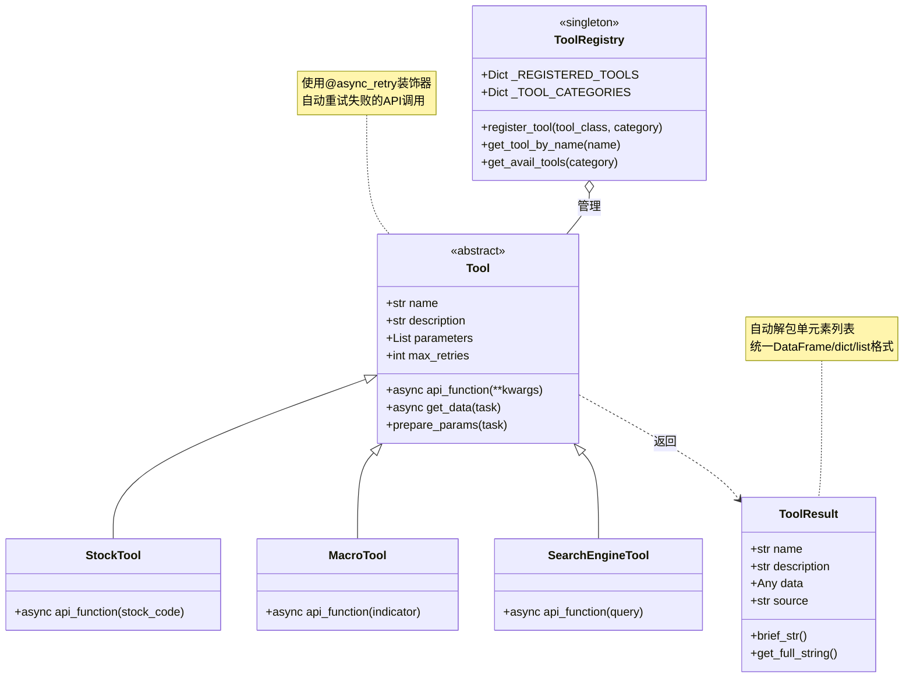

# `src/tools/` 开发者备忘录

## 1. 模块定义 (The "Why")

**一句话描述**:  
插件化的数据源API封装层，提供结构化数据采集工具的自动注册、统一调用和结果标准化机制。

**核心职责**:  
- **工具基类**: 定义Tool接口规范(name, description, parameters, api_function)  
- **自动注册机制**: 扫描子目录自动发现并注册工具类到全局注册表  
- **分类管理**: financial/macro/industry/web四大类工具的独立命名空间  
- **结果标准化**: ToolResult封装异构数据(DataFrame/dict/list)为统一格式

---

## 2. 黑盒模型 (I/O Analysis)

| 类型 | 描述 | 关键文件/变量 |
| :--- | :--- | :--- |
| **Input (依赖)** | 重试装饰器(`utils/retry.py`)、异步执行工具、日志系统(`logger.py`)、Pandas/NumPy(数据处理) | `from ..utils.retry import async_retry`<br>`from ..utils.logger import get_logger` |
| **Output (暴露)** | Tool基类、ToolResult数据容器、工具注册器(`register_tool`)、工具查询API(`get_tool_by_name`, `get_avail_tools`) | `__all__ = ['Tool', 'ToolResult', 'get_avail_tools', ...]` |

---

## 3. 内部逻辑流 (The Logic)

### 文件拓扑

| 文件 | 职责 |
| :--- | :--- |
| `base.py` | Tool基类与ToolResult定义，提供重试、错误处理逻辑(135行) |
| `__init__.py` | 自动注册引擎、全局工具注册表、查询API(175行) |
| `financial/` | 财务数据工具(股票stock.py、财报company_statements.py、市场market.py) |
| `macro/` | 宏观经济工具(macro.py) |
| `industry/` | 行业数据工具(industry.py) |
| `web/` | 网络工具(搜索search_engine_*.py、爬虫web_crawler.py) |

### 逻辑可视化



### 自动注册流程

```mermaid
flowchart TD
    A[模块导入: import src.tools] --> B[_auto_register_tools]
    B --> C[pkgutil.walk_packages扫描子目录]
    C --> D[导入所有子模块]
    
    D --> E{遍历模块成员}
    E -->|issubclass of Tool?| F[提取类对象]
    E -->|No| E
    
    F --> G[解析模块路径]
    G --> H{确定category}
    H -->|financial.*| I[category='financial']
    H -->|macro.*| J[category='macro']
    H -->|web.*| K[category='web']
    
    I --> L[register_tool]
    J --> L
    K --> L
    
    L --> M[_REGISTERED_TOOLS[tool_name] = tool_class]
    M --> N[_TOOL_CATEGORIES[category].append(tool_name)]
    
    style B fill:#e1f5ff
    style L fill:#ffe1e1
    style M fill:#fff4e1
```

---

## 4. 避坑指南 (Attention)

### 硬编码参数

| 位置 | 硬编码值 | 说明 | 修改建议 |
| :--- | :--- | :--- | :--- |
| **__init__.py Line 24-29** | `{'financial', 'macro', 'industry', 'web'}` | 工具分类硬编码 | 可配置化或自动推断 |
| **base.py Line 20** | `max_retries=3` | 默认重试次数 | 应从Config读取 |
| **base.py Line 78** | `delay=1.0, backoff=2.0` | 重试间隔与退避系数 | 可作为Tool初始化参数 |
| **base.py Line 95-96** | 单元素列表自动解包 | `if len(data)==1: data=data[0]` | **慎重修改**，可能破坏预期行为 |

### 复杂条件判断

#### ⚠️ 自动注册逻辑 (\_\_init\_\_.py Line 119-158)

**多重嵌套条件**:
```python
for submodule in submodules:
    for name, obj in inspect.getmembers(module, inspect.isclass):
        if (issubclass(obj, Tool) and 
            obj != Tool and 
            obj.__module__ == module.__name__):  # 🔥 关键判断
```

**避坑要点**:  
- `obj.__module__ == module.__name__`用于排除从其他模块import的类  
- 如果在`__init__.py`中`from .submodule import *`，会导致重复注册  
- **修改建议**: 增加已注册检查(`if tool_name in _REGISTERED_TOOLS: skip`)

#### ⚠️ Tool实例化时机 (\_\_init\_\_.py Line 33)

```python
tool_name = tool_class().name  # 🔥 立即实例化获取name
```

**问题**:  
- 如果Tool的`__init__`需要必选参数会报错  
- 浪费资源，注册时不应实例化  

**修改建议**:
```python
# 改为类属性
class StockTool(Tool):
    name = "stock_tool"  # 类属性
    
# 或使用类方法
@classmethod
def get_name(cls): return "stock_tool"
```

#### ⚠️ ToolResult数据截断 (base.py Line 117-124)

```python
format_string += str(self.data)[:100]  # 🔥 硬编码100字符
```

**避坑要点**:  
- DataFrame可能截断重要的列名  
- 大型dict/list会丢失结构信息  
- **修改建议**: 
  - 增加参数控制截断长度  
  - 对于DataFrame使用`to_string(max_rows=5, max_cols=10)`  

### 线程安全问题

⚠️ **全局注册表不支持并发修改**:
```python
_REGISTERED_TOOLS: Dict[str, Type[Tool]] = {}  # 🔥 非线程安全
```

**风险场景**:  
- 多线程同时调用`register_tool`会导致竞争条件  
- **修改建议**: 使用`threading.Lock`保护注册操作

### 重试陷阱

#### ⚠️ 嵌套重试 (base.py Line 77-82)

```python
async def _get_data_with_retry(self, **params):
    @async_retry(max_attempts=self.max_retries, ...)  # 动态装饰器
    async def _fetch():
        return await self.api_function(**params)
```

**问题**:  
- 每次调用都创建新的装饰器实例，性能开销  
- 如果`api_function`内部也有重试，会产生指数级重试  

**修改建议**:  
- 在类初始化时缓存装饰后的函数  
- 明确文档说明`api_function`不应自带重试逻辑

### 性能注意

| 操作 | 时间复杂度 | 优化建议 |
| :--- | :--- | :--- |
| 模块导入 | O(n*m) (n个模块, m个类) | 使用延迟加载(lazy import) |
| `get_tool_by_name` | O(1) 字典查找 | 无需优化 |
| `get_avail_tools(category)` | O(k) (k个工具) | 可缓存结果 |
| ToolResult字符串化 | O(n) DataFrame行数 | 设置`max_rows`限制 |

### 调试技巧

```python
# 查看所有已注册工具
from src.tools import get_tool_categories, list_tools
print("所有工具:", list_tools())
print("分类:", get_tool_categories())

# 测试单个工具
from src.tools import get_tool_by_name
StockTool = get_tool_by_name('stock_info')
tool = StockTool()
result = await tool.api_function(stock_code='000001')

# 检查注册表
from src.tools import _REGISTERED_TOOLS
print(f"已注册{len(_REGISTERED_TOOLS)}个工具")

# 调试自动注册
import src.tools
# 在__init__.py Line 135添加print查看扫描的模块
```

### 常见错误

#### 1. 工具未被注册

**症状**: `get_tool_by_name`返回None  
**原因**:  
- 工具类未继承Tool  
- 模块导入失败(依赖缺失)  
-文件名不符合Python模块规范(`-`应改为`_`)

**排查**:  
```python
# 检查导入错误
import importlib
importlib.import_module('src.tools.financial.stock')  # 手动验证
```

#### 2. ToolResult哈希冲突

**症状**: 相同name+description的结果被去重  
**原因**: `__hash__`和`__eq__`实现仅基于name和description  

```python
# Line 131-135
def __hash__(self):
    return hash(self.name+self.description)
def __eq__(self, other):
    return self.name == other.name and self.description == other.description
```

**修改建议**: 增加timestamp或随机salt避免碰撞
