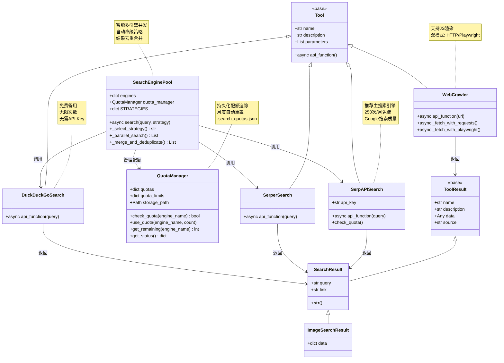
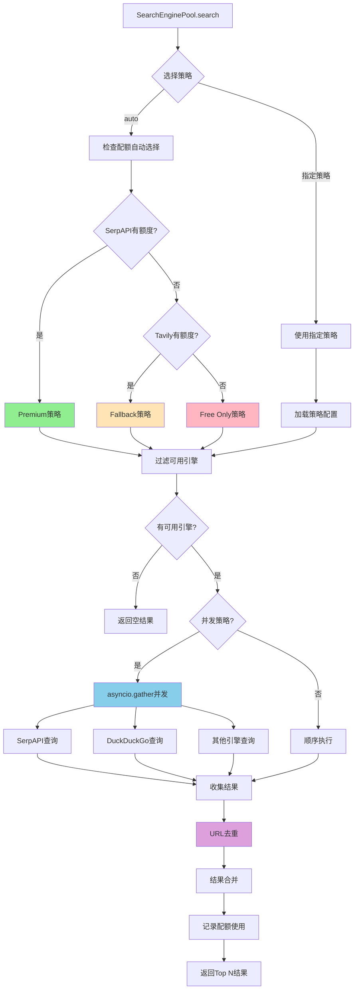
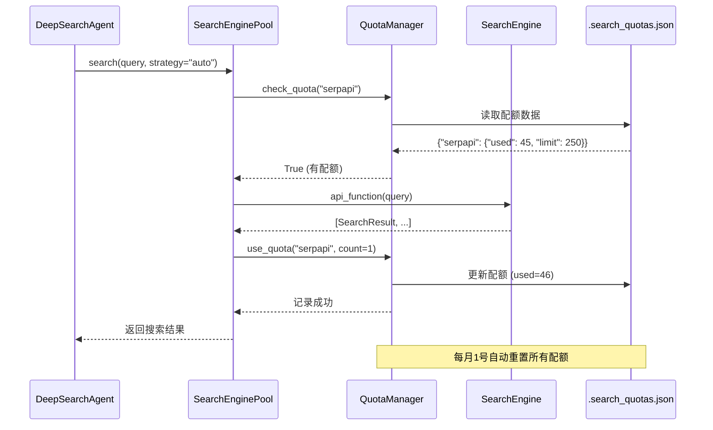

# `src/tools/web/` 开发者备忘录

## 1. 模块定义 (The "Why")

**一句话描述**:  
网络搜索与爬虫工具集，负责从互联网采集非结构化信息（搜索结果、网页内容）。

**核心职责**:  
- **多引擎搜索**: 集成多个搜索引擎API（SerpAPI、Serper、Bing、DuckDuckGo等），提供统一接口
- **网页抓取**: 通过异步HTTP或浏览器自动化获取网页完整内容
- **结果标准化**: 将不同来源的数据转换为统一的`SearchResult`格式
- **降级策略**: 主搜索引擎失败时自动切换到备用引擎

---

## 2. 黑盒模型 (I/O Analysis)

| 类型 | 描述 | 关键文件/变量 |
| :--- | :--- | :--- |
| **Input (依赖)** | `Tool`, `ToolResult` 基类（定义工具接口）<br>HTTP客户端库（`httpx`, `requests`）<br>浏览器自动化（`playwright`）<br>环境变量（`SERPAPI_API_KEY`, `SERPER_API_KEY`等） | `from ..base import Tool, ToolResult`<br>`import httpx`<br>`from playwright.async_api` |
| **Output (暴露)** | 搜索引擎工具类（`SerpAPISearch`, `BingSearch`, `DuckDuckGoSearch`等）<br>网页爬虫工具（`WebCrawler`）<br>统一结果容器（`SearchResult`, `ImageSearchResult`） | `class SearchResult(ToolResult)`<br>`class SerpAPISearch(Tool)` |

---

## 3. 内部逻辑流 (The Logic)

### 文件拓扑

| 文件 | 职责 |
| :--- | :--- |
| `base_search.py` | 定义搜索结果容器类`SearchResult`和`ImageSearchResult`，继承自`ToolResult` |
| `quota_manager.py` | **配额管理器**：追踪搜索引擎API配额使用情况，支持月度自动重置和持久化存储 |
| `search_engine_pool.py` | **智能搜索引擎池**：管理多引擎并发查询，支持自动降级和结果去重 |
| `search_engine_serpapi.py` | **主搜索引擎**：SerpAPI集成（Google搜索，250次/月免费），推荐首选 |
| `search_engine_requests.py` | **备用搜索引擎集合**：包含5个HTTP请求方式的搜索引擎（Serper、Bing、DuckDuckGo、Sogou、Bocha） |
| `search_engine_playwright.py` | **浏览器自动化搜索**：使用Playwright模拟真实浏览器，绕过反爬虫限制 |
| `web_crawler.py` | **网页内容抓取**：支持HTTP抓取和Playwright渲染，返回完整HTML/Markdown内容 |

### 逻辑可视化



### 多引擎并发搜索流程



### 配额管理机制



---

## 4. 避坑指南 (Attention)

### 硬编码参数

| 位置 | 硬编码值 | 说明 | 修改建议 |
| :--- | :--- | :--- | :--- |
| **serpapi.py:69** | `"num": 10` | SerpAPI返回结果数量 | 可提取为配置参数 |
| **serpapi.py:70-71** | `"gl": "cn"`, `"hl": "zh-cn"` | 地理位置和语言（已注释） | 根据查询语言动态设置 |
| **requests.py:196** | `timeout=30.0` | HTTP超时时间 | 可能需要根据网络环境调整 |
| **crawler.py** | 各种User-Agent字符串 | 浏览器标识 | 定期更新以避免被识别为爬虫 |
| **requests.py:390** | `domain_list[:2]` | 金融网站域名搜索限制为2个 | 可配置化 |

### 复杂条件判断

#### ⚠️ SerpAPI响应结构检查 (serpapi.py:86-101)

**复杂度**: 需要处理多种异常情况

```python
if 'error' in results:
    # API错误（配额用尽、Key无效等）
    return []

if 'organic_results' not in results:
    # 结构异常
    return []

if not organic_results:
    # 无结果
    return []
```

**避坑要点**:  
- SerpAPI可能返回多种错误格式（`'error'`, `'message'`, `statusCode`）
- 不同搜索引擎(`engine`)返回字段不同（`organic_results` vs `organic`）
- **修改建议**: 统一错误处理函数

#### ⚠️ 搜索引擎选择逻辑 (search_agent.py，不在此目录但依赖本模块)

**注意**: DeepSearchAgent会根据API Key是否配置、配额是否用完来选择搜索引擎。

**避坑要点**:
- 如果所有搜索引擎都失败，会导致死循环重试
- **修改建议**: 设置最大重试次数，记录失败状态

#### ⚠️ WebCrawler双模式切换 (web_crawler.py)

**复杂度**: HTTP抓取失败后切换到Playwright

```python
try:
    content = await self._fetch_with_requests(url)
    if not content or len(content) < 500:
        # HTTP抓取结果异常，尝试浏览器渲染
        content = await self._fetch_with_playwright(url)
except:
    # 降级到Playwright
    content = await self._fetch_with_playwright(url)
```

**避坑要点**:
- `len(content) < 500` 硬编码阈值可能误判
- Playwright启动开销大（2-5秒），频繁切换会慢
- **修改建议**: 根据URL特征提前判断是否需要JS渲染

#### ⚠️ SearchEnginePool并发控制 (search_engine_pool.py:144-180) **新增**

**复杂度**: 多引擎并发查询的协调和错误处理

```python
tasks = []
for engine_name in available_engines:
    task = asyncio.create_task(self._safe_search(engine, engine_name, query))
    tasks.append(task)

results = await asyncio.gather(*tasks, return_exceptions=True)
```

**避坑要点**:
- `asyncio.gather` 默认第一个异常会中断所有任务，需设置 `return_exceptions=True`
- 如果所有引擎同时失败，应有明确的错误信息而非静默返回空列表
- 并发数过多可能导致IP被封禁
- **修改建议**: 限制并发数量（最多3-5个引擎），添加重试机制

#### ⚠️ QuotaManager配额重置时机 (quota_manager.py:56-67) **新增**

**复杂度**: 月度自动重置逻辑

```python
current = datetime.now()
if current.year != last_reset.year or current.month != last_reset.month:
    return self._init_quotas()  # 重置
```

**避坑要点**:
- 时区问题：服务器时区和本地时区不一致可能导致重置时间错误
- 第一次运行时配额文件不存在会初始化
- 月末最后一天和下月第一天之间如果不运行，配额不会重置
- **修改建议**: 使用UTC时间+定时任务确保每月准时重置

#### ⚠️ URL去重算法 (search_engine_pool.py:265-283) **新增**

**复杂度**: 多引擎结果去重

```python
url = result.link.lower().strip().rstrip('/')
if url and url not in seen_urls:
    seen_urls.add(url)
    merged_results.append(result)
```

**避坑要点**:
- 仅去除尾部斜杠可能不够（`http` vs `https`、`www` vs non-`www`）
- 不同引擎返回的URL可能带不同参数（如 `?utm_source=...`）
- **修改建议**: 使用 `urllib.parse` 规范化URL，去除query参数

---

### API配额管理

| 搜索引擎 | 免费额度 | 超额处理 |
| :--- | :--- | :--- |
| **SerpAPI** | 250次/月 | 返回`'error': 'quota_exceeded'`，需切换到备用引擎 |
| **Serper** | 2500次 | 返回403 Unauthorized |
| **DuckDuckGo** | 无限 | 频繁请求可能触发反爬虫限制（返回空结果） |
| **Bing** | 取决于Azure账户 | |

**建议**: 
1. 实现配额监控（记录每日使用次数）
2. 主动降级策略（接近配额时优先使用免费引擎）

### 性能注意

| 操作 | 时间开销 | 优化建议 |
| :--- | :--- | :--- |
| SerpAPI搜索 | 0.5-2秒 | 已是最优 |
| DuckDuckGo搜索 | 1-3秒 | 增加并发请求数 |
| Playwright启动 | 2-5秒（首次） | 复用browser实例 |
| Playwright网页渲染 | 3-10秒/页 | 设置合理的超时时间 |

### 调试技巧

```python
# 1. 测试单个搜索引擎
cd d:\Codes\my_project\FinReport_Agent
python src/tools/web/search_engine_serpapi.py

# 2. 检查SerpAPI配额
from src.tools.web.search_engine_serpapi import check_serpapi_account
check_serpapi_account()

# 3. 测试多引擎并发搜索 (新增)
from src.tools.web.search_engine_pool import create_default_pool
import asyncio

pool = create_default_pool()
results = asyncio.run(pool.search("Python tutorial", strategy="premium"))

# 4. 查看所有引擎配额状态 (新增)
from src.tools.web.quota_manager import print_quota_status
print_quota_status()

# 5. 手动重置配额（用于测试） (新增)
from src.tools.web.quota_manager import QuotaManager
quota_mgr = QuotaManager()
quota_mgr.reset_quota("serpapi")  # 重置指定引擎
quota_mgr.reset_quota()           # 重置所有引擎

# 6. 启用详细日志
import logging
logging.basicConfig(level=logging.DEBUG)

# 7. 测试网页抓取（带/不带JS）
from src.tools.web.web_crawler import WebCrawler
crawler = WebCrawler()
result = await crawler.api_function(url="https://example.com")

# 8. 测试不同搜索策略 (新增)
pool = create_default_pool()
results_premium = await pool.search(query, strategy="premium")     # SerpAPI + DuckDuckGo
results_fallback = await pool.search(query, strategy="fallback")   # Tavily + DuckDuckGo  
results_free = await pool.search(query, strategy="free_only")      # 仅DuckDuckGo
results_auto = await pool.search(query, strategy="auto")           # 自动选择最佳策略
```

---

## 5. 使用示例

### 快速开始

```python
from src.tools.web import create_default_pool
import asyncio

async def main():
    # 创建搜索引擎池
    pool = create_default_pool()
    
    # 使用auto策略（自动选择最佳引擎组合）
    results = await pool.search(
        query="浪潮信息 000977 财报",
        max_results=10,
        strategy="auto"
    )
    
    # 查看结果
    for i, result in enumerate(results, 1):
        print(f"{i}. {result.name}")
        print(f"   {result.link}")
    
    # 查看配额使用情况
    pool.print_quota_status()

asyncio.run(main())
```

### 高级用法

```python
# 自定义引擎组合
from src.tools.web import SearchEnginePool, QuotaManager
from src.tools.web import SerpAPISearch, DuckDuckGoSearch

engines = {
    "serpapi": SerpAPISearch(),
    "duckduckgo": DuckDuckGoSearch(),
}

# 使用自定义配额管理器
custom_quota_mgr = QuotaManager(storage_path="./custom_quotas.json")
pool = SearchEnginePool(engines, quota_manager=custom_quota_mgr)

# 强制使用指定策略
results = await pool.search(query, strategy="premium")
```

