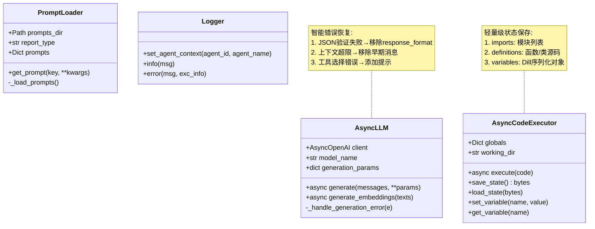
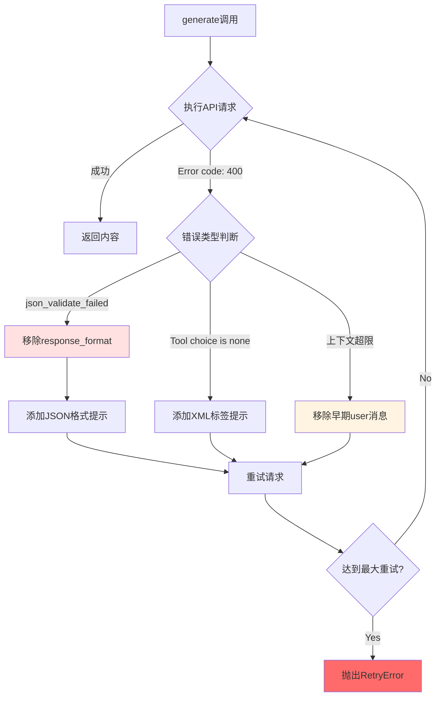

# `src/utils/` 开发者备忘录

## 1. 模块定义 (The "Why")

**一句话描述**:  
跨模块共享的纯技术工具函数库，提供LLM调用、代码执行沙箱、提示词加载、日志管理等底层基础设施。

**核心职责**:  
- **LLM封装**: 统一OpenAI兼容API调用，自动重试、错误恢复、上下文管理  
- **代码执行器**: 安全的Python沙箱环境，支持状态序列化/恢复  
- **Prompt管理**: YAML模板加载器，支持报告类型与模块名的灵活查找  
- **日志系统**: Agent上下文感知的日志记录器  
- **向量索引**: Embedding生成与语义搜索(IndexBuilder)  
- **辅助函数**: 图像处理、PDF解析、重试装饰器

---

## 2. 黑盒模型 (I/O Analysis)

| 类型 | 描述 | 关键文件/变量 |
| :--- | :--- | :--- |
| **Input (依赖)** | OpenAI SDK(`AsyncOpenAI`)、Pandas/NumPy(数据处理)、Dill(序列化)、YAML解析器、Logging模块 | `from openai import AsyncOpenAI`<br>`import dill`<br>`import yaml` |
| **Output (暴露)** | AsyncLLM类、AsyncCodeExecutor类、PromptLoader工厂、get_logger函数、重试装饰器(`async_retry`) | `__all__ = ['AsyncLLM', 'AsyncCodeExecutor', 'get_logger', ...]` |

---

## 3. 内部逻辑流 (The Logic)

### 文件拓扑

| 文件 | 职责 |
| :--- | :--- |
| **`llm.py`** | LLM与Embedding客户端封装，智能重试与错误处理(274行) |
| **`code_executor_async.py`** | **当前核心**: 异步代码沙箱，状态序列化/恢复、环境变量管理(320行) |
| **`code_executor.py`** | **Legacy**: 基于IPython的同步执行器，已弃用 |
| **`code_executor_legacy.py`** | **Legacy**: 历史版本的代码执行器，已弃用 |
| **`prompt_loader.py`** | YAML Prompt加载器，支持多报告类型与模块查找(116行) |
| **`logger.py`** | Agent上下文感知的结构化日志系统 |
| **`index_builder.py`** | 向量索引构建与语义搜索 |
| **`retry.py`** | 装饰器工厂(`@async_retry`, `@retry`) |
| **`figure_helper.py`** | 图像Base64编码、文件处理 |
| **`helper.py`** | 通用辅助函数 |

### 逻辑可视化



### AsyncLLM错误处理流程



---

## 4. 避坑指南 (Attention)

### 硬编码参数

| 位置 | 硬编码值 | 说明 | 修改建议 |
| :--- | :--- | :--- | :--- |
| **llm.py Line 24** | `max_attempts=3, delay=1.0, backoff=2.0` | 默认重试参数 | 可在__init__配置 |
| **llm.py Line 138** | `max_retries_per_model=5` | LLM重试上限 | 应从Config读取 |
| **code_executor.py Line 68** | `'SimHei', 'sans-serif'` | 字体回退列表 | 中文环境硬编码 |
| **code_executor.py Line 274** | Matplotlib配置header | 每次execute都重复执行 | **性能影响**，应移至__init__ |
| **prompt_loader.py Line 34** | `parent_specific_file`逻辑 | 模糊匹配规则 | 增加配置优先级文档 |

### 复杂条件判断

#### ⚠️ AsyncLLM多重错误恢复 (llm.py Line 210-256)

**嵌套条件**:
```python
if "Error code: 400" not in error_msg:
    return True  # 其他错误继续重试
if "json_validate_failed" in error_msg:
    params.pop('response_format')
    messages[-1]["content"] += "IMPORTANT: ..."
elif "Tool choice is none" in error_msg:
    messages[-1]["content"] += "IMPORTANT: ..."
else:
    # 上下文超限
    _remove_early_message(messages)
```

**避坑要点**:  
- 错误检测依赖字符串匹配，API错误格式变化会失效  
- **直接修改messages**导致副作用，可能污染后续调用  
- **修改建议**: 深拷贝messages，或返回修改后的新列表

#### ⚠️ CodeExecutor状态序列化 (code_executor_async.py Line 96-183)

**复杂逻辑**:
```python
def save_state():
    # 1. 收集模块导入
    for name, value in globals.items():
        if isinstance(value, types.ModuleType): ...
    # 2. 收集函数/类定义(通过inspect.getsource)
    # 3. 收集简单变量(is_simple递归判断)
    # 4. Dill序列化
```

**避坑要点**:  
- `inspect.getsource`仅对`__module__=='__main__'`的对象有效  
- **DataFrame不会被序列化**(Line 144: `if isinstance(obj, pd.DataFrame): return False`)  
- 执行`exec`动态定义的函数可能无法还原  
- **修改建议**: 增加序列化失败的详细日志

#### ⚠️ PromptLoader模糊匹配 (prompt_loader.py Line 26-42)

**查找顺序**:
```python
1. {report_type}_prompts.yaml (如 financial_company_prompts.yaml)
2. {report_type.split('_')[0]}_prompts.yaml (如 financial_prompts.yaml)
3. prompts.yaml (通用回退)
```

**避坑要点**:  
- `report_type='financial_company'`会先找`financial_prompts.yaml`而非精确匹配  
- 单词拆分逻辑(`split('_')[0]`)可能不适用所有命名  
- **修改建议**: 增加配置层级说明文档，或使用JSON配置查找优先级

### 线程安全问题

⚠️ **CodeExecutor的globals不支持并发**:
```python
self.globals: Dict[str, Any] = {}  # 🔥 非线程安全
```

**风险场景**:  
- 多个Agent并发调用同一个executor会相互污染全局变量  
- **当前设计**: 每个Agent独立的executor实例(Line 61: `AsyncCodeExecutor(self.executor_path)`)  
- **修改建议**: 如果未来需要共享executor，必须加锁

### 性能陷阱

#### ⚠️ Matplotlib字体配置重复 (code_executor.py Line 274)

```python
async def execute(code):
    header = "import matplotlib..."  # 🔥 每次都导入
    code = header + '\n' + code
```

**问题**: 每次execute都重新配置Matplotlib，浪费资源  
**修改建议**: 在`__init__`中执行一次font配置，移除header拼接

| 操作 | 时间复杂度 | 优化建议 |
| :--- | :--- | :--- |
| AsyncLLM.generate | O(n) 消息数 | 定期清理conversation_history |
| CodeExecutor.save_state | O(m) 变量数 | 增量保存或跳过DataFrame |
| PromptLoader._load_prompts | O(1) 单次YAML解析 | 可缓存已加载的Prompt |

### 调试技巧

```python
# 测试LLM重试机制
from src.utils import AsyncLLM
llm = AsyncLLM(base_url=..., api_key=..., model_name=...)
import asyncio
# 模拟上下文超限
long_messages = [{"role": "user", "content": "x"*100000}]
result = asyncio.run(llm.generate(messages=long_messages))

# 调试CodeExecutor状态
from src.utils import AsyncCodeExecutor
executor = AsyncCodeExecutor('test_dir')
await executor.execute("x = 100")
state = executor.save_state()
print(f"State size: {len(state)} bytes")

# 检查Prompt加载路径
from src.utils.prompt_loader import get_prompt_loader
loader = get_prompt_loader('data_analyzer', report_type='financial_company')
print(loader.prompts_dir)  # 确认最终加载的路径

# 测试日志Agent上下文
from src.utils import get_logger
logger = get_logger()
logger.set_agent_context('agent_123', 'data_collector')
logger.info("Test message")  # 检查日志格式
```

### 常见错误

#### 1. Prompt找不到

**症状**: `get_prompt('xxx')`返回None或抛出警告  
**原因**: YAML文件路径错误或key不存在  
**排查**:
```python
loader.list_available_prompts()  # 查看所有key
```

#### 2. CodeExecutor序列化失败

**症状**: `save_state()`抛出Dill异常  
**原因**: 全局变量包含Lambda、未
序列化的类实例  
**解决**: 检查`globals`内容，避免复杂对象

#### 3. LLM无限重试

**症状**: `generate`长时间卡住  
**原因**: `_handle_generation_error`返回True导致无限循环  
**解决**: 设置`max_retries_per_model`上限
